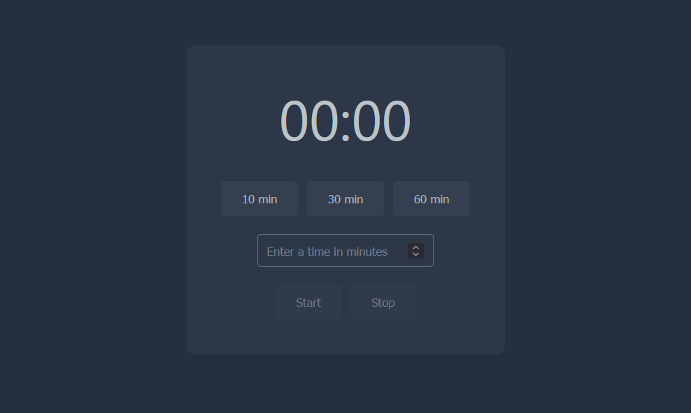

# Timer

A simple timer application built with HTML, CSS, and JavaScript.

## Features
- Set timer for predefined times (10, 30, 60 minutes)
- Set custom timer
- Start and stop the timer
- Notification when the timer ends

## Example
[Live Demo](https://www.sylvainbrehaut.com/Timer/index.html)
